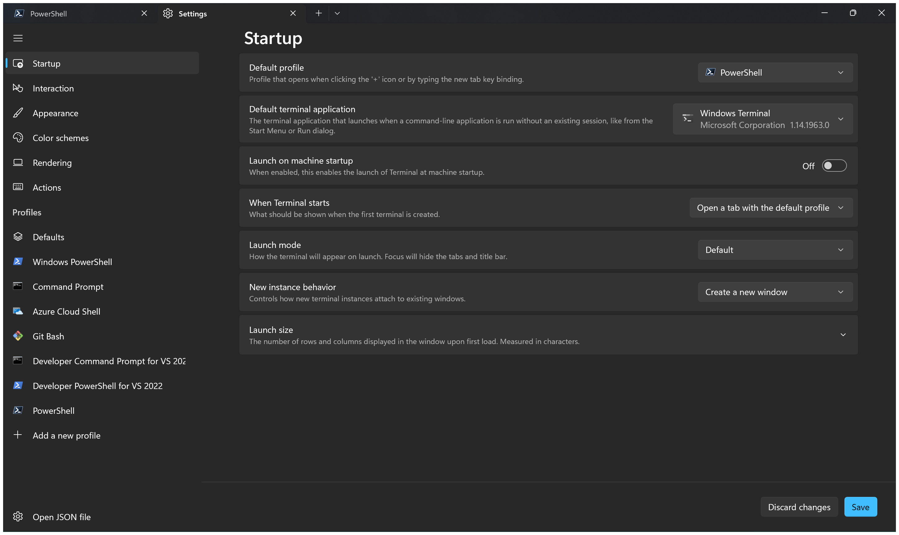
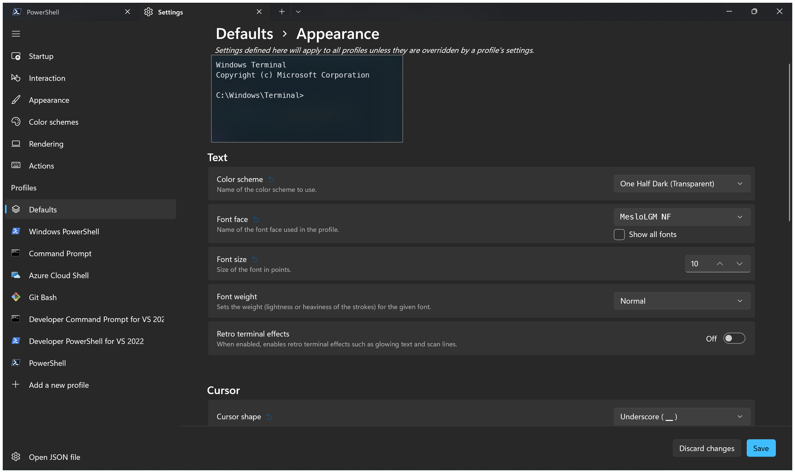
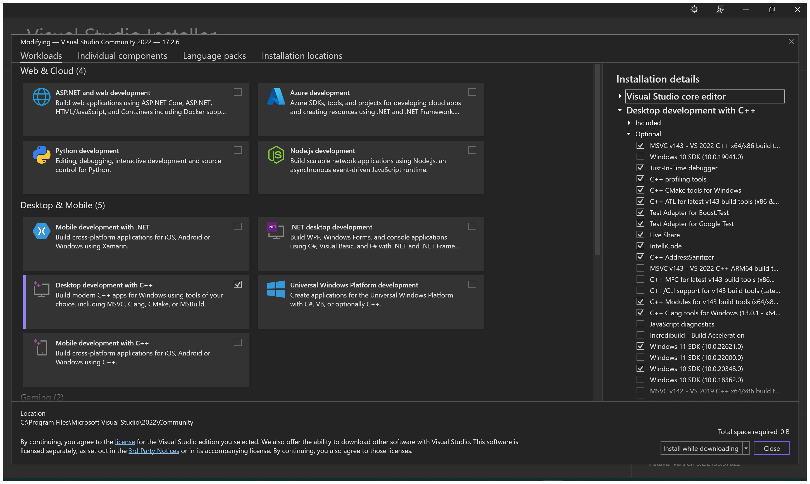
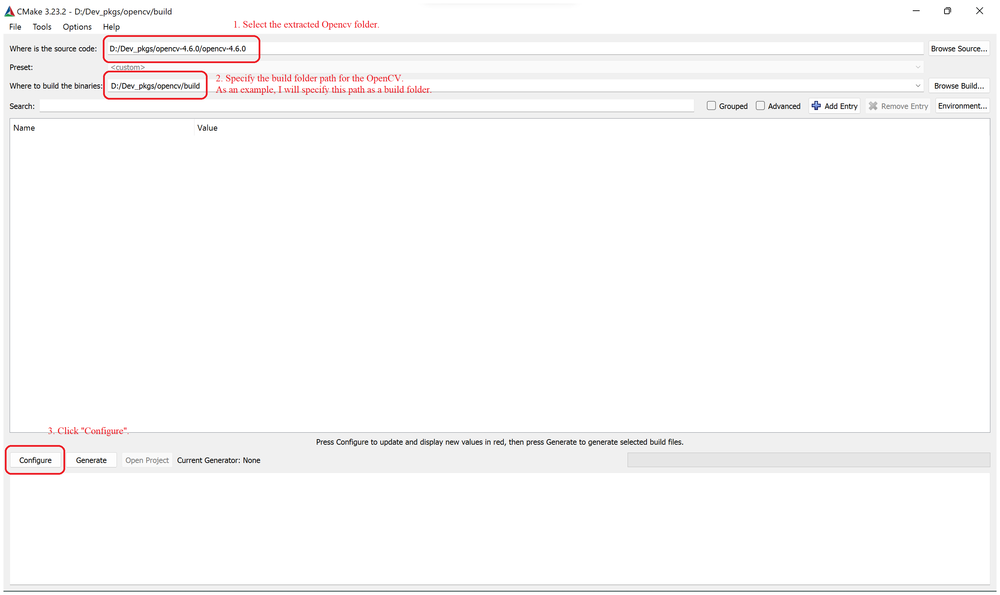
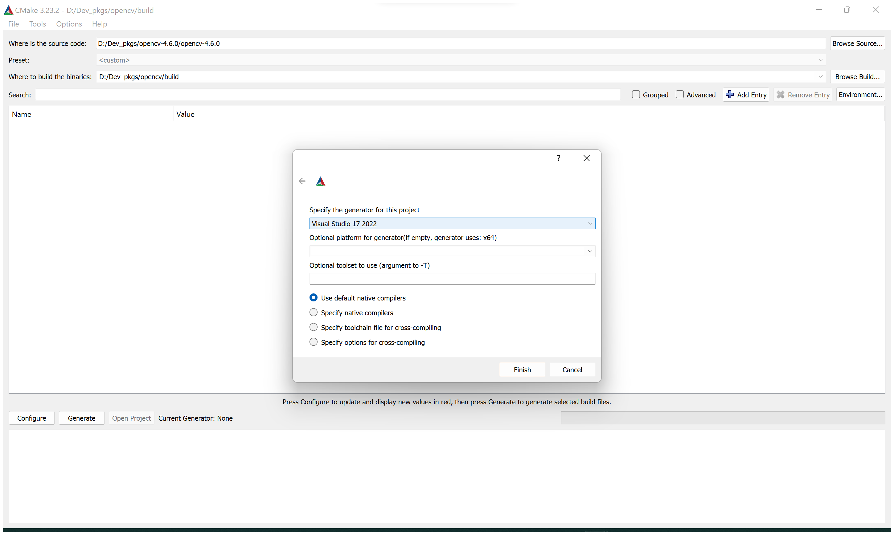
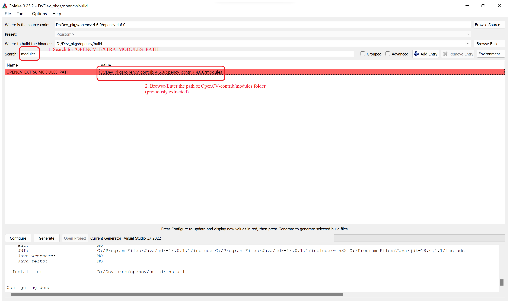
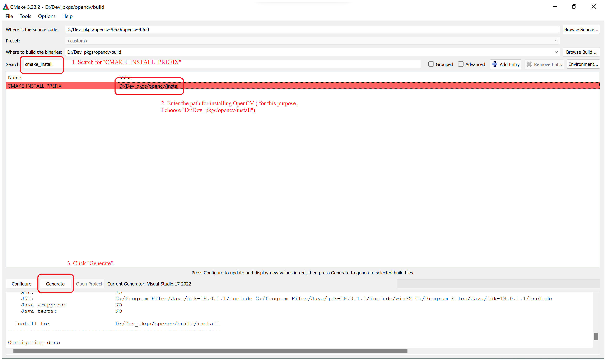
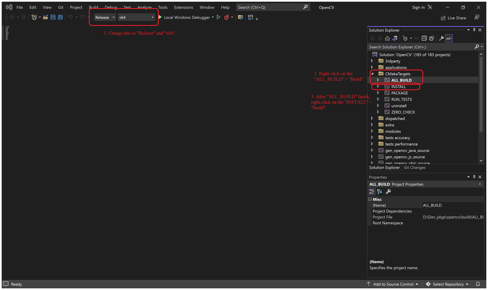
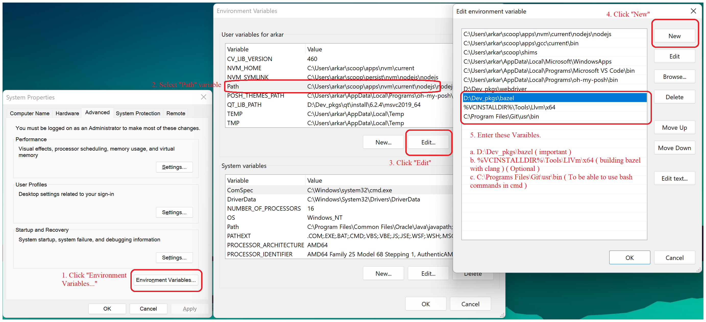
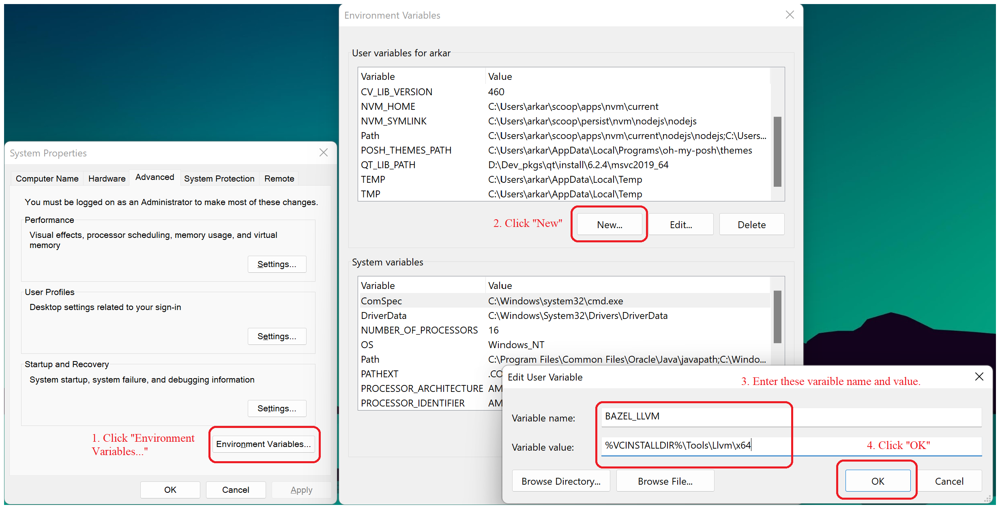

# Development Environment for Windows

<details><summary> Configure Powershell</summary>

<br>

- [Install Powershell.](#install-powershell)
- [Install VSCode - 1.70.0](#install-vscode---1700)
- [Setup Powershell Terminal with oh-my-posh](#setup-powershell-terminal-with-oh-my-posh)
- [Install Git](#install-git)
- [Install PSReadLine - Autocompletion in Powershell](#install-psreadline---autocompletion-in-powershell)
- [Install Terminal-icons](#install-terminal-icons)
- [Install Posh-Git](#install-posh-git)

## Install Powershell.

[Here](https://apps.microsoft.com/store/detail/windows-terminal/9N0DX20HK701?hl=en-mm&gl=MM).

## Install VSCode - 1.70.0

[Get it](https://code.visualstudio.com/sha/download?build=stable&os=win32-x64-user).

## Setup Powershell Terminal with oh-my-posh

In Windows Terminal, change the default profile to **Powershell**. To open the setting, press **Ctrl + ,**.

<details><summary> View Image</summary>



</details>

<br>
In the terminal, type

```
winget install JanDeDobbeleer.OhMyPosh -s winget
```
Launch new Powershell with administrator.

```
oh-my-posh font install
```
In the font list, install FiraCode and Meslo.

Then change the font in Windows Terminal. To open the setting, press **Ctrl + ,**.

<details><summary> View Image</summary>



</details>

> We need to change font for the terminal to render the icon needed for oh-my-posh themes.

To see available themes and apply it to terminal, enter the following command,

```
Get-PoshThemes
oh-my-posh init pwsh --config $env:POSH_THEMES_PATH\amro.omp.json | Invoke-Expression
```

But above theme change will be disappeared everytime you launch new terminal. To make changes everytime,

```
code .\.config\powershell\user_profile.ps1
```

In the file, write the following code snippet and save.

```
# oh-my-posh prompt
oh-my-posh init pwsh --config $env:POSH_THEMES_PATH\amro.omp.json | Invoke-Expression
```

Go back to your terminal, type

```
code $PROFILE.CurrentUserCurrentHost
```

In the file, write the following command and save.

```
. ${env:USERPROFILE}\.config\powershell\user_profile.ps1
```

## Install Git

Launch the powershell.

```
winget install --id Git.Git -e --source winget
```

## Install PSReadLine - Autocompletion in Powershell

Launch the powershell.

```
Install-Module -Name PSReadLine -AllowPrerelease -Scope CurrentUser -Force -SkipPublisherCheck
```
Set options for PSReadLine

Reopen the user_profile.ps1.

```
code .\.config\powershell\user_profile.ps1
```

In the file, add the following contents, and save.

```
# PSReadLine 
Set-PSReadLineOption -EditMode Emacs
Set-PSReadLineOption -BellStyle None
Set-PSReadLineKeyHandler -Chord 'Ctrl+d' -Function DeleteChar
Set-PSReadLineOption -PredictionSource History
Set-PSReadLineOption -PredictionViewStyle ListView
```

## Install Terminal-icons

Launch the Powershell.

```
Install-Module -Name Terminal-Icons -Repository PSGallery -Force
```

## Install Posh-Git

Launch the Powershell.

```
Install-Module posh-git -Scope CurrentUser
```

<span style="color:red"> Note that importing modules when the user launch the powershell will slow down the powershell startup time. 

That's why I put it inside the command called <b>init-mod</b>. If you want to load the modules, please invoke the above commmand.

Final <i><b>user_profile.ps1</b></i> will look like below</span>

<details><summary> View File Content</summary>

```
# oh-my-posh prompt
oh-my-posh init pwsh --config $env:POSH_THEMES_PATH\amro.omp.json | Invoke-Expression

# PSReadLine 
Set-PSReadLineOption -EditMode Emacs
Set-PSReadLineOption -BellStyle None
Set-PSReadLineKeyHandler -Chord 'Ctrl+d' -Function DeleteChar
Set-PSReadLineOption -PredictionSource History
Set-PSReadLineOption -PredictionViewStyle ListView

# Alias
Set-Alias grep findstr
Set-Alias bash 'C:\Program Files\Git\bin\bash.exe'
Set-Alias tig 'C:\Program Files\Git\usr\bin\tig.exe'
Set-Alias less 'C:\Program Files\Git\usr\bin\less.exe'

# Command - which
function which ( $command ) {
    Get-Command -Name $command -ErrorAction SilentlyContinue | 
        Select-Object -ExpandProperty Path -ErrorAction SilentlyContinue
}

# Command - init-mod
# For Importing Modules
function init-mod () {
    Import-Module posh-git
    Import-Module -Name Terminal-Icons
}
```
</details>

</details>

<br>

<details><summary> Install OpenCV in Windows </summary>

<br>

- [Install CMake - 3.24.0](#install-cmake---3240)
- [Install Visual Studio](#install-visual-studio)
- [Download OpenCV sources](#download-opencv-sources)
- [Install OpenCV](#install-opencv)

## Install CMake - 3.24.0

[Here](https://github.com/Kitware/CMake/releases/download/v3.24.0/cmake-3.24.0-windows-x86_64.msi).

Please select *Add Cmake to the system path for all users* during installation.

## Install Visual Studio

[Download](https://c2rsetup.officeapps.live.com/c2r/downloadVS.aspx?sku=community&channel=Release&version=VS2022&source=VSLandingPage&includeRecommended=true&cid=2030) from here. Install and Open the visual studio installer.

In Visual Studio Installer, search for **Desktop Development with C++**. Please check and install the tools according to the following image.

<details><summary> View Image </summary>



</details> <br>

After installation is completed, please check the environment variable in the powershell.
```
echo $Env:VCINSTALLDIR
```
This should print - "C:\Program Files\Microsoft Visual Studio\2022\Community\VC". If not, please open environment variable window to set the variable.

## Download OpenCV sources

- [OpenCV](https://github.com/opencv/opencv/archive/refs/tags/4.6.0.zip) - 4.6.0
- [OpenCV-contrib](https://github.com/opencv/opencv_contrib/archive/refs/tags/4.6.0.zip) - 4.6.0

## Install OpenCV

1. Extract both zip files to folder.
2. Open **CMake-Gui** application.
3. Please proceed according to the figures below.

<details><summary> View Image </summary>



</details><br>

4. After clicking "**Configure**", you will be asked for build folder creation ( "Yes" ) and choose compiler. 
Please select "**Visual Studio 17 2022**"

<details><summary> View Image </summary>



</details><br>

5. Please wait for configuration to be done and then, search for "opencv_extra_modules_path" and "cmake_install_prefix". Then Click "**Generate**" button to begin the generation process.

  <details><summary> View Image </summary>

  

  

  </details> <br>

6. After generation process is finished, click the "**Open Project**" button besides "**Generate**" button. This will open up the "**Visual Studio**".

7. In "**Visual Studio**", 

<details><summary> View Image </summary>



</details> <br>

You've done setting up OpenCV for Windows. If you have any questions, please open an issue.

</details>

<br>

<details><summary> Install Bazel in Windows </summary>

<br>

## Download bazel - 5.2.0

- [Here](https://github.com/bazelbuild/bazel/releases/download/5.2.0/bazel-5.2.0-windows-x86_64.exe).

1. Rename the "**bazel-5.2.0-windows-x86_64.exe**" to "**bazel.exe**".
2. Move the exe file to under "**D:/Dev_pkgs/bazel/**". 
3. Update the *PATH* environment variable of user variable, please check below image.

<details><summary> View Image </summary>



</details>

<br>

You can check the bazel whether it is working or not by calling this command.

Launch new powershell.

```
bazel --version # bazel 5.2.0
```

4. If you want to use bazel with "**Clang**", you must do the following step.

<details><summary> View Image </summary>



</details>

</details>

<br>

You're all set. Good to go. Happy coding! :smile: